# Run #
```
docker-compose -f "docker-compose.yml" up -d --build  
```

```
siege -c10 -t60S http://127.0.0.1:8082/mysqltest/GetWithoutIndex?datebirth={FORMAT: yyyy-MM-dd}&flushLogLevel={VALUE: innodb_flush_log_at_trx_commit}  
siege -c10 -t60S http://127.0.0.1:8082/mysqltest/GetWithIndexBTREE?datebirth={FORMAT: yyyy-MM-dd}&flushLogLevel={VALUE: innodb_flush_log_at_trx_commit}  
```

## siege -c25 ##
(insert new user and get select)  
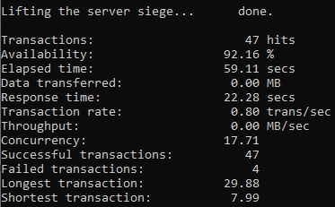  
socket: 537147848 select timed out: Connection timed out  
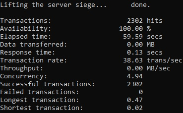  
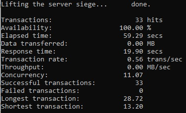  
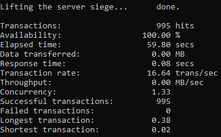  
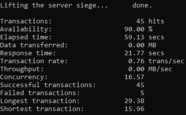  
socket: 537146840 select timed out: Connection timed out  
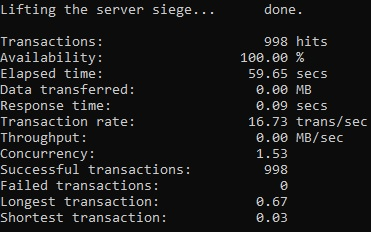  

## siege -c50 ##
(insert new user and get select)  
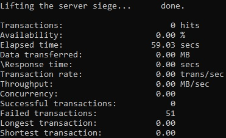  
socket: 537154472 select timed out: Connection timed out  
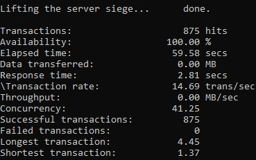  
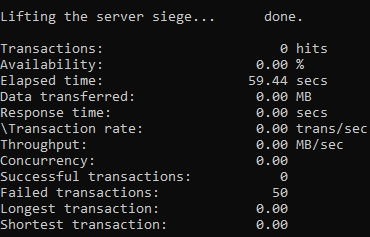  
socket: 537152456 select timed out: Connection timed out  
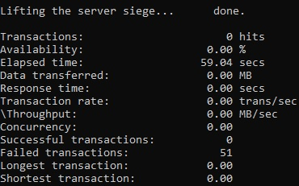  
socket: 537150592 select timed out: Connection timed out  
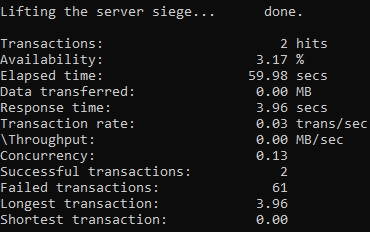  
socket: 537154760 select timed out: Connection timed out
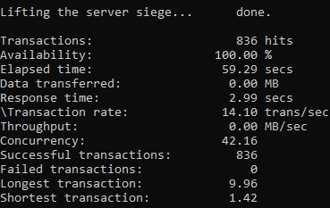  
